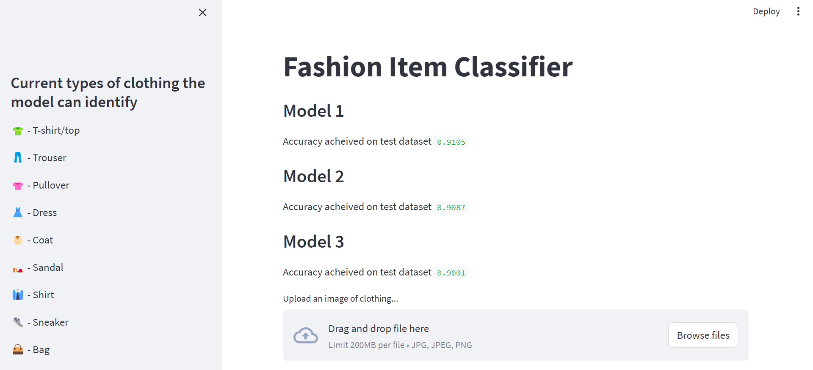

# Fashion Item Classifier

<!-- link of the project -->
[Deployed project](https://fashionclassifer.streamlit.app)



This is a Streamlit web application that classifies clothing items into various categories. Users can upload an image of clothing, and the app will use three different models to predict the category of the item.

# Models

The app utilizes three different  models for clothing classification, each with its own architecture:

### Model 1

- Architecture:
  - Convolutional Layer 1: 32 filters, kernel size 3x3, ReLU activation
  - MaxPooling Layer: 2x2
  - Flatten Layer
  - Dense Layer: 128 units, ReLU activation
  - Output Layer: 10 units, Softmax activation

### Model 2

- Architecture:
  - Convolutional Layer 1: 32 filters, kernel size 3x3, ReLU activation
  - MaxPooling Layer: 2x2
  - Convolutional Layer 2: 64 filters, kernel size 3x3, ReLU activation
  - MaxPooling Layer: 2x2
  - Flatten Layer
  - Dense Layer 1: 128 units, ReLU activation
  - Dropout Layer: 0.25
  - Dense Layer 2: 256 units, ReLU activation
  - Dropout Layer: 0.25
  - Dense Layer 3: 128 units, ReLU activation
  - Output Layer: 10 units, Softmax activation

### Model 3

- Architecture:
  - Convolutional Layer 1: 64 filters, kernel size 3x3, ReLU activation
  - MaxPooling Layer: 2x2
  - Convolutional Layer 2: 128 filters, kernel size 3x3, ReLU activation
  - MaxPooling Layer: 2x2
  - Convolutional Layer 3: 64 filters, kernel size 3x3, ReLU activation
  - MaxPooling Layer: 2x2
  - Flatten Layer
  - Dense Layer 1: 128 units, ReLU activation
  - Dropout Layer: 0.25
  - Dense Layer 2: 256 units, ReLU activation
  - Dropout Layer: 0.5
  - Dense Layer 3: 256 units, ReLU activation
  - Dropout Layer: 0.25
  - Dense Layer 4: 128 units, ReLU activation
  - Dropout Layer: 0.10
  - Output Layer: 10 units, Softmax activation

# Installation

To run Predictstock locally, follow these steps:

1. Clone this repository to your local machine.

   ```bash
   git clone https://github.com/rajsahu2004/Fashion-Item-Classifier.git
   ```


2. Install the requirements:

   ```bash
   pip install -r requirements.txt
   ```

3. Run the Streamlit app.

    ```bash
    streamlit run app.py
    ```

4. Open a web browser and access the app at `https://localhost :8501`


# Usage

1. Access the app in your web browser.

2. Upload an image of clothing.

# Contributing 

Contributions are welcome! If you'd like to enhance Predictstock or fix any issues, please fork the repository and submit your pull requests.

# License

This project is licensed under the MIT License - see the [LICENSE](LICENSE) file for details.